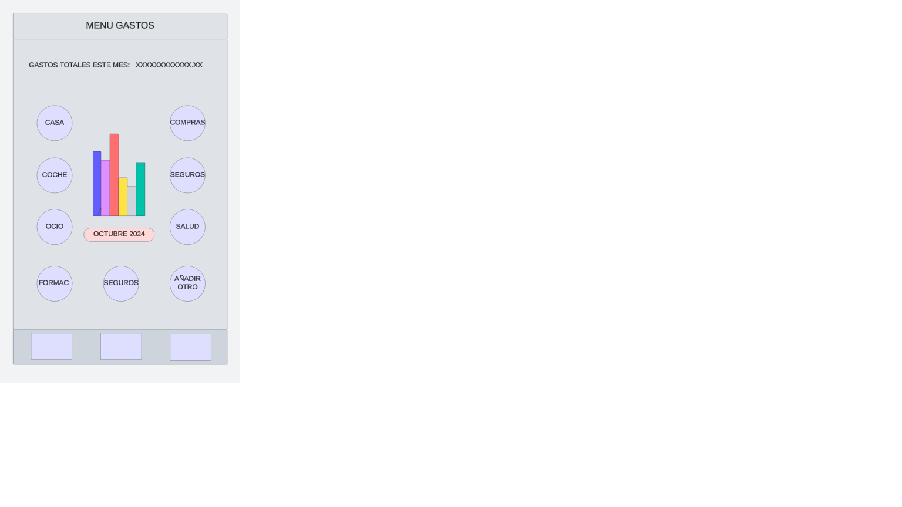
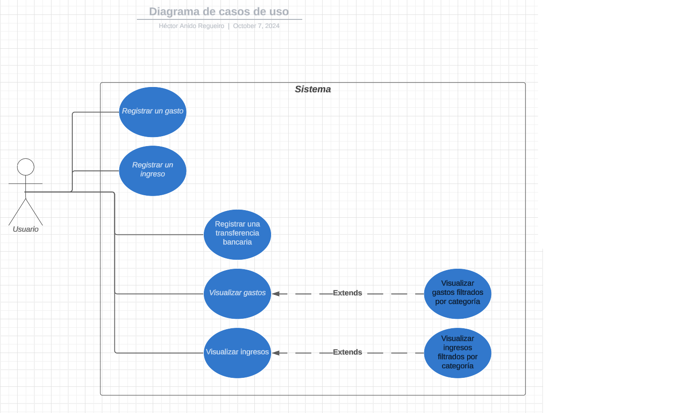

# Proyecto FCAS. Documento de análisis de requerimientos.

## Descripción del Proyecto:

El propósito es construir una aplicación móvil que, de manera fácil, rápida e intuitiva permita registrar gastos e ingresos económicos al usuario.

## Funcionalidades:

Las características principales de la aplicación será la gestión de gastos principalmente junto a la gestión de ingresos y transferencias. Permitirá llevar un registro de estos tres conceptos y permitirá su visualización tanto a nivel global como filtrado por diferentes categorías y conceptos.

## Requisitos de Hardware y Software:

La API de Android objetivo es la 31, que corresponde a Android 12. Los requisitos hardware mínimos serían los siguientes:
- Procesador: Qualcomm Snapdragon 450 o equivalente.
- RAM: 3 GB.
- Almacenamiento interno: 32 GB.
- Pantalla: resolución de 720p (1280x720)
- Conectividad: Wi-Fi 802.11 b/g/n, Bluetooth 4.0.

El hardware recomendado sería el siguiente:
- Procesador: Qualcomm Snapdragon 660 o superior.
- RAM: 4 GB o más (ideal: 6 GB)
- Almacenamiento interno: 64 GB.
- Pantalla: resolución de 1080p (FHD)
- Conectividad: Wi-Fi 802.11 ac, Bluetooth 5.0

Consideraciones de hardware adicionales:
- Gráficos: GPU Adreno 506 o superior para un rendimieto gráfico fluido.
- Sensores: GPS, acelerómetro y giroscopio (en previsión de posibles futuras funcionalidades)

Principales tecnologías de software a utilizar:
- View Binding.
- ViewModel con LiveData.
- Room para consistencia de datos.
- Fragmentos.
- RecyclerView para gestión de las listas a visualizar.
- Navigation.

## Interfaces:

El usuario navegará por la interfaz de la aplicación mediante el flujo normal de la aplicación y mediante barras de navegación: "Navigation Drawer", "Bottom Navigation Bar", botones "FAB", etc.
El feedback se gestionará principalmente mediante elementos "Toast" y se tendrá en cuenta incluir también elementos "Snackbar" en los casos en los que sea más adecuado.
Ejemplo de diseño de GUI para la pantalla principal de gastos:

## Casos de uso:

## Futuras Mejoras:

- Registro de presupuestos personalizados.
- Visualización y control de los datos mediante gráficas y estadísticas.
- Integración con aplicaciones de banca.
- En el caso de integración con otras aplicaciones, integración con servicios en la nube, redes sociales, etc. una de las mejoras debería ser en seguridad (cifrado de datos).